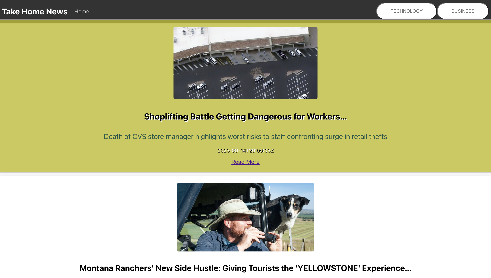
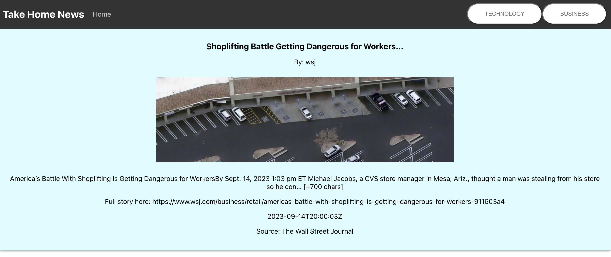

# Take Home News

The Take Home News app is a demonstration of my basic react and css skills. Three things I focused on implementing outside of smooth and simple functionality are URI encoding, useParams hook and simple yet fun button styling. URI encoding is a way to safely encode the `title` parameter in the URL in my GetData component. UseParams is a hook in React that allows you to access parameters in the URL of a component. You can use it to retrieve information from the URL and use it to render specific content based on that information. For example, in a news app, you could use `useParams` to retrieve the title of an article from the URL and display the article's content on the page. Lastly, I added animation to my catagory buttons just for a little fun and to feed my passion to learn more CSS animation techniques.

## Introduction

My name is Isaiah Richardson and this is my Take-Home challenge app for Turing School of Software and design. This app was designed in 6-8 hours using React and CSS

## Technologies

- React
    - React Router
- CSS

## Features

This app features a detailed view and clickable links to articles a user is interested in and two different categories to filter interest between Tech and Business.

## Installation

To run this app locally, follow these steps:

1. Clone this repository to your local machine.
2. Navigate to the project directory and install the dependencies using `npm install`.
3. Start the development server using `npm start`.
4. Open your browser and navigate to `http://localhost:3000` to view the app.

Note: You will need to have Node.js and npm installed on your machine to run this app.

That's it! You should now be able to run the app locally and explore its features.

## Usage

## Contributing

Isaiah Richardson

GitHub: https://github.com/CapCinematic

LinkedIn: https://www.linkedin.com/in/isaiah-cap-richardson/